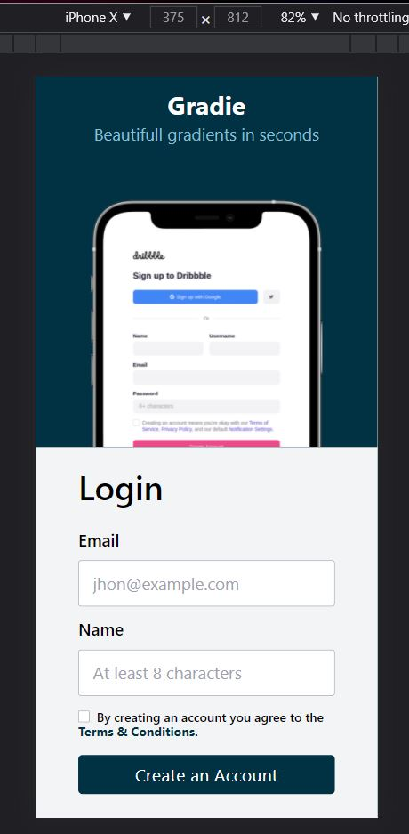
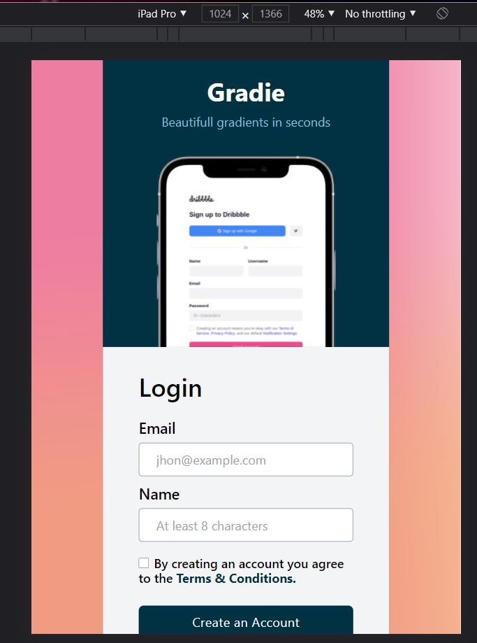
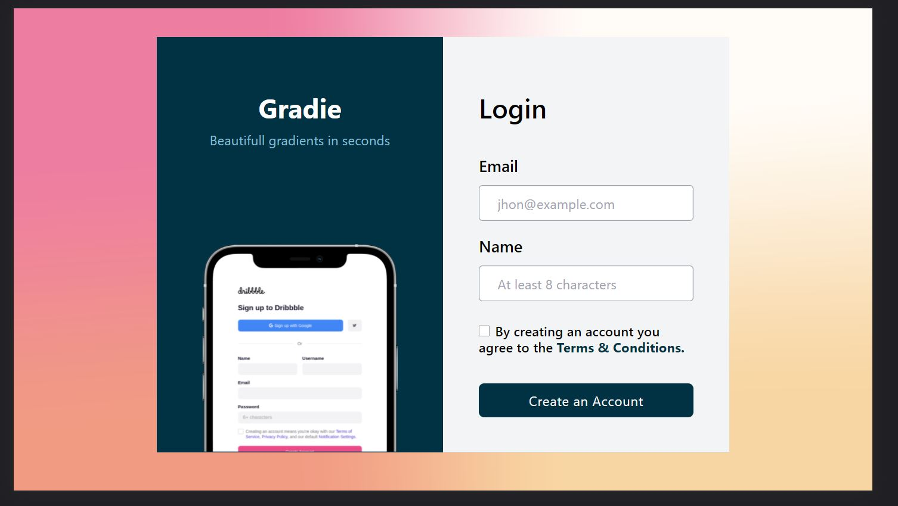

# Gradie Sign up page

This is a Challenge accepted from [codewell](https://www.codewell.cc/challenges/608ac420650dff001599e8ec). It is a sign up page designed using Tailwind css.

[**click here to view the component**](https://harishkumaaran.github.io/Gradiesignup/)
&nbsp;

# screenshots
&nbsp;

### Mobile version

&nbsp;

### Tablet version

&nbsp;

### Desktop version

&nbsp;

&nbsp;

# Technology Stack
- HTML
- CSS
- Tailwind CSS

&nbsp;

# Credits
- This Gradie signup page challenge is done as a part of my Front end curriculum at Aekam Labs, Coimbatore.

